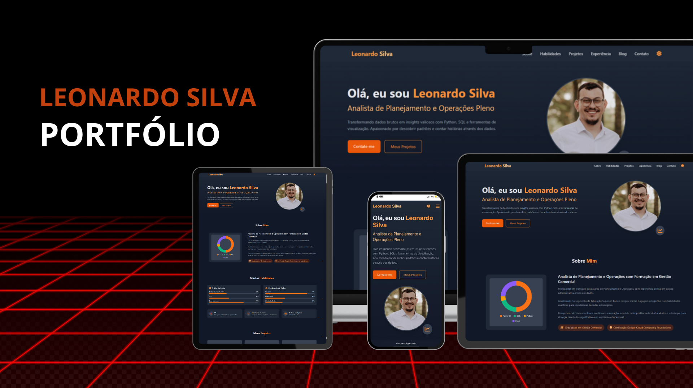

# Portfólio Pessoal de Leonardo Silva


**Visite o site ao vivo:** [Portfólio - Leonardo Silva](https://oleonardof.github.io/meu-portfolio/)



---

## 🚀 Sobre o Projeto

Este projeto é meu portfólio pessoal, uma página única (one-page) desenvolvida para apresentar minhas habilidades, projetos e experiência profissional como Analista de Dados. O objetivo foi criar uma interface limpa, moderna e responsiva, utilizando tecnologias web fundamentais.

## 🤖 Filosofia e Desenvolvimento com IA

Um diferencial deste repositório é que ele foi **100% desenvolvido com o auxílio de Inteligência Artificial (Google Gemini Pro)**. A filosofia por trás disso é demonstrar como ferramentas de IA podem ser utilizadas para construir projetos web completos e profissionais.

O processo serviu como um guia prático, mostrando que é possível, mesmo para quem não é especialista em front-end, criar uma presença online de alta qualidade com a orientação correta, facilitando o acesso a um portfólio bem estruturado.

## ✨ Principais Funcionalidades

* **Design Responsivo:** O layout se adapta perfeitamente a desktops, tablets e celulares.
* **Navegação com Scroll Suave:** O menu principal navega entre as seções da página com uma animação de rolagem suave.
* **Modo Claro e Escuro:** Um botão de toggle permite ao usuário alternar entre os temas, com a preferência salva no navegador.
* **Gráfico de Habilidades Interativo:** Um gráfico de rosca (Doughnut Chart) na seção "Sobre Mim" para visualizar minhas competências em linguagens de programação.
* **Animações Sutis:** Efeitos de hover e uma animação "flutuante" na imagem de perfil para uma experiência mais dinâmica.
* **Formulário de Contato Funcional:** Um formulário de contato integrado com um serviço de backend (como Web3Forms ou FormSubmit) que envia as mensagens diretamente para o meu e-mail.
* **Botão "Voltar ao Topo":** Facilita a navegação de volta para o início da página.

## 🛠️ Tecnologias Utilizadas

* **Estrutura:** HTML5 Semântico
* **Estilização:** Tailwind CSS (carregado via CDN) e CSS3 para animações customizadas.
* **Interatividade:** JavaScript (Vanilla JS)
* **Gráficos:** Chart.js
* **Ícones:** Font Awesome
* **Hospedagem:** Cloudflare Pages

## ⚙️ Como Executar Localmente

Por ser um projeto web estático, não há necessidade de um passo de "build" ou instalação de dependências.

1.  **Clone o repositório:**
    ```bash
    git clone [https://github.com/seu-usuario/seu-repo-portfolio.git](https://github.com/seu-usuario/seu-repo-portfolio.git)
    ```
2.  **Abra o arquivo:** Navegue até a pasta do projeto e abra o arquivo `index.html` diretamente em qualquer navegador web.

## 📜 Licença

O conteúdo e o código deste projeto estão sob uma licença customizada que permite a visualização para fins pessoais e não comerciais, mas não a cópia ou distribuição. Para mais detalhes, veja o arquivo [LICENSE](LICENSE).

---

**Leonardo Silva** - [LinkedIn](https://www.linkedin.com/in/oleonardof/) · [GitHub](https://github.com/oleonardof)
